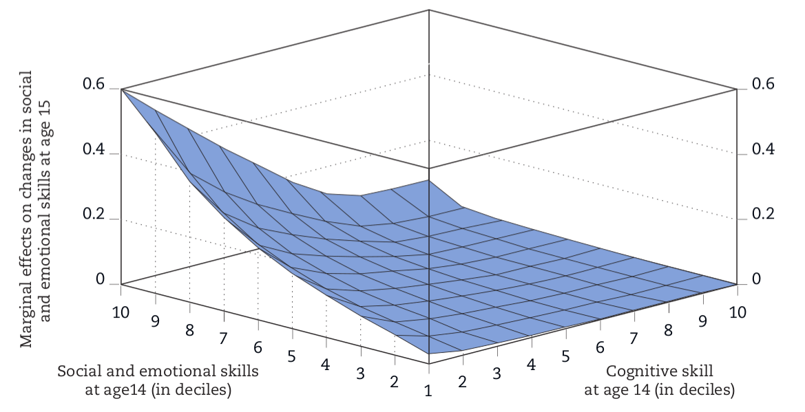
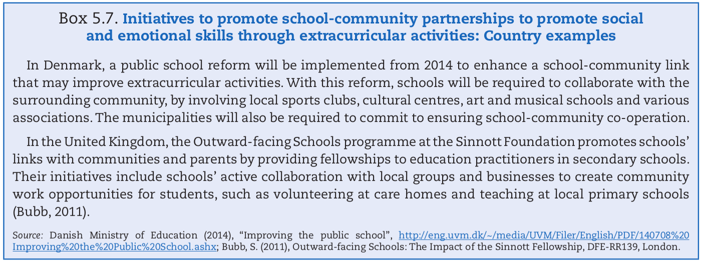

```{r xaringan-panelset, echo=FALSE}
xaringanExtra::use_panelset()
```
```{r xaringan-tile-view, echo=FALSE}
xaringanExtra::use_tile_view()
```
```{r broadcast, echo=FALSE}
xaringanExtra::use_broadcast()
```
# Conducive Learning Environment

is a platform devoid of both physical intimidation and emotional frustration, which allows for a free exchange of ideas.

--

The key proponents of the learning process are teachers and learners, as such their freedom of interaction, safety and respect should be equally guaranteed within the physical and emotive environment they find themselves in.

--

Emotions play a crucial role in both teaching and learning and therefore should be harnessed and embraced.

---
# Investing in children's skills sufficiently early is important

investments in social and emotional skills made at any point in time must have an impact on the productivity of all future investments in skills. 

--

Early investments should therefore allow children to reap higher returns over a longer period-of-time.

--

For cognitive skills, evidence, including findings from neuroscience, suggests the importance of early investment in raising general cognitive skills
---
# Findings in investing as early as possible

???
the figure suggests that an additional investment in social and emotional skills at age 14
will only enhance future investment productivity in social and emotional skills for those who have
a higher level of social and emotional skills in the first place.
---
# The Big Five Factors

An existing framework that fosters both individual characteristics and education through adequate practices.
Costa and McCrae (1992) provide a list of important facets corresponding to each of these factors.

.panelset[
.panel[.panel-name[Extraversion]
.pull-left[Is perhaps the most often used and most familiar of the influences. Extraverts are typically marked by vitality, positive feelings, and confidence.]
]
.panel[.panel-name[Agreeableness]
.pull-left[It may be distinguished by characteristics such as compassion, modesty, and competence. As a result, all variables are critical when collaborating with others.]
]
.panel[.panel-name[Conscientiousness]
.pull-left[It requires becoming proactive, working to succeed, and behaving in a goal-directed way, and it is essential to creating objectives.]
]
.panel[.panel-name[Emotional Stability]
.pull-left[This term refers to the capacity to cope with stressful, emotional states and levels of stress, which is critical for effective emotion management]
]
.panel[.panel-name[Openness]
.pull-left[Consider unique encounters the much more challenging of the causes since they contribute to various factors such as attention to art and culture, a desire for variety, and academic interest.]
]
]
---

# Programmes designed to raise social and emotional skills
.panelset[
.panel[.panel-name[Tools of mind]
.pull-left[attempts to teach preschool and early-primary schoolchildren to regulate their social and
cognitive behaviour.

example: role-play and learn in groups with other children.]
]

.panel[.panel-name[Low-cost]

.pull-left[to enhance the “Mindset” of children

capabilities are malleable and that learning can change the structure of the
brain (Dweck, 2007).

This programme aims to instill the idea that achievement is the result of hard
work rather than inborn intelligence]
]

.panel[.panel-name[One goal]
.pull-left[trains high-school teachers to help students apply to colleges, improve grades and test scores, and persist through college by cultivating social and emotional skills]
]
]

???
The first is “Tools of the Mind”, which attempts to teach preschool
and early-primary school children to regulate their social and
cognitive behaviour.

The second is a low-cost programme designed to enhance the
“Mindset” of children in such a way that children believe capabilities
are malleable and that learning can change the structure of the
brain (Dweck, 2007).

Main goal of the Mindset experiment is to promote educational achievement,
the process involves enhancing social and emotional skills such as perseverance
and will power

The third is the One Goal programme, which selects and trains high-
school teachers to help students apply to colleges, improve grades
and test scores, and persist through college by cultivating social and
emotional skills
---
# Development of social and emotional skills in school subjects

There are lot of countries that already dedicated a school subjects for the development of social and emotional skills, it is important for the students to enhance it for them to understand themselves.

.panelset[

.panel[.panel-name[implementation]
In Israel they have a curriculum for primary and secondary schools that introduce the subjects “Life Skills Studies”. This subject aims to develop students’ social and emotional skills and strengthen their ability to cope with various life situations.

In England, personal, social, health and economic education (PSHE) is offered as a non-statutory subject in lower secondary schools. The subject is expected to contribute to personal development by helping students build their personal identities, confidence and self-esteem, make career choices and understand what influences their decisions, including financial ones.
]

.panel[.panel-name[findings]
.pull-left[
Teachers are given flexibility to deliver the subject based on their students’ needs. 

The Department for Education provides grant funding to the PSHE Association to work closely with schools to advise them in developing their own PSHE curricula and to improve the quality of teaching.]
]

.panel[.panel-name[conclusion]
.pull-left[The main goal this study is to help the learners to develop their social and emotional skills, and also help them on personal development because it will help them build their self-esteem, confidence and personal identities. If the learners already build their confidence and self-esteem it can now help them to develop their social and emotional skills.]
]
]

---
# Initiative to promote school-community partnerships

School-community partnerships provides additional opportunities for social learning

.panelset[

.panel[.panel-name[implementation]

]

.panel[.panel-name[findings]
.pull-left[Schools in most countries mobilise a range of extracurricular activities to enhance social and
emotional skills]
]

.panel[.panel-name[conclusion]
.pull-left[There is strong evidence that extracurricular activities increase self-esteem and positive social behaviors among children and adolescents]
]
]
---
# Group Conclusions

- The stakeholders of the school should invest in the developing the social and emotional skills of young learners.

--

- The teacher should consider the factors that determines the social and emotional skills of the learner to achieve conducive classroom environment.

--

- Continuous integration of forming the social and emotional skills of the learners.

--

- The teacher should be flexible in considering the needs of the learner to instill the social and emotional skills.

--

- The school should be the catalyst of social interaction. 