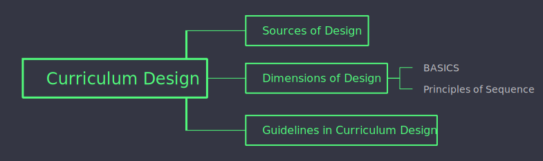

```{r xaringan-themer, include=FALSE, warning=FALSE}
library(xaringanthemer)
style_mono_accent(base_color = "#fff")
```

```{r xaringan-panelset, echo=FALSE}
xaringanExtra::use_panelset()
```

# Topic Outline

---
# Curriculum Design
Concerned with the nature and arrangement of the four basic curriculum parts:

- Objectives

--

- Contents

--

- Activities

--

- Evaluation

---

# Sources of Design

#### **Science**
The scientific method provides meaning for the curriculum design

--

#### **Society** 
Schools should draw its deals for the curriculum from the analysis of the social situations

--

#### **Knowledge**
"What knowldege is most worth"

--

#### **Learner**
Curriculum should be derived from what we know about learners.

--

#### **Eternal and Divine Sources**
Designers should draw from past for guidance as to what is appropriate content

---
# Dimensions of Curriulum Design
.panelset[
  .panel[.panel-name[B]
### Balance
Equitable assignment of content, time, experiences and other elements of design
  ]
  
  .panel[.panel-name[A]
### Articulation
Interrelatedness of **horizontal** and **vertical aspects** of curriculum
  ]
  
  .panel[.panel-name[S]
### Scope
The **breaths** and **depths** of the curriculum
  ]
  
  .panel[.panel-name[I]
### Integration
Refer to the linking of all types of knowledge

Example: Business Planning in Grade 10. Students must integrate skills from other subject. Grammar, Economics and Math
  ]
  
  .panel[.panel-name[C]
### Continuity
Vertical repetition and recurring appearance of content

Example: Spiral Curriculum
  ]
  
  .panel[.panel-name[S]
### Sequence
Provides continuous and cumulative learning
  ]
]

---

# Four Principles of Sequence 

1. Simple to complex 

--

2. Prerequisite 

--

3. Whole to Part 

--

4. Chronological 
---
# Five Major Principles of Sequence

.panelset[
  .panel[.panel-name[World]
  

  ]

   .panel[.panel-name[Concept]
  

  ]

   .panel[.panel-name[Inquiry]
  

  ]
   .panel[.panel-name[Learning]
  

  ]
.panel[.panel-name[Utilization]
  

  ]
]

---
# Table of Continuity and Sequence
<div style="display:flex;width=50%;">
<table width=60%>
  <tr>
    <th>Curriculum 1</th>
    <th>Curriculum 2</th>
    <th>Curriculum 3</th>
  </tr>
  <tr>
    <td>A</td>
    <td>A</td>
    <td>A</td>
  </tr>
  <tr>
    <td>B</td>
    <td>B</td>
    <td>B</td>
  </tr>
  <tr>
    <td>C</td>
    <td> </td>
    <td>D</td>
  </tr
  <tr>
    <td>D</td>
    <td>D</td>
    <td>C</td>
  </tr>
  <tr>
    <td>E</td>
    <td>E</td>
    <td>E</td>
  </tr>
  <tr>
    <td>F</td>
    <td> </td>
    <td>F</td>
  </tr>
  <tr>
    <td>G</td>
    <td>G</td>
    <td>H</td>
  </tr>
  <tr>
    <td>H</td>
    <td>H</td>
    <td>G</td>
  </tr>
</table>
</div>
---
# Guidelines in Curriculum Design

- Should involve **teachers, parents, administrators and students**

--

- In line with **mission, vision, goals and objectives** of school

--

- Consider the **interests** of the learners

--

- Alternative curriculum design should consider the **cost, scheduling, class size, facilities and persons required**

--

- The curriculum design should take into account **cognitive, affective, and psychomotor** concepts and outcomes
---

# References

Aaron Paul Tañedo. (2016). Curriculum organization. Slideshare.net. https://www.slideshare.net/aaronpaultanedo/curriculum-organization-72760657

Cee, J. (2014). Dimensions and principles of curriculum design. Slideshare.net. https://www.slideshare.net/Darkwind1/dimensions-and-principles-of-curriculum-design-36432024?fbclid=IwAR2uiaBA_1abVeg22MU69uLyVezy5ULqgC-_QlPkqb_0rODff_x1RHVkRes


Jaydee's Corner. (2021). PEDx | Curriculum Designing [YouTube Video]. In YouTube. https://www.youtube.com/watch?v=Xc5ygQsx_-Q


<a href=report.pdf>download</a> this presentation

