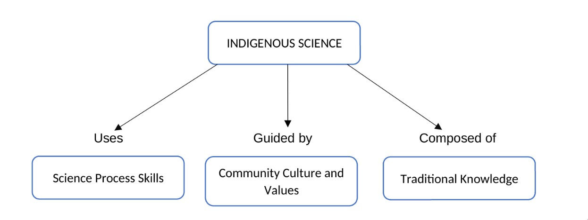

```{r setup, include=FALSE}
options(htmltools.dir.version = FALSE)
knitr::opts_chunk$set(
  fig.width=9, fig.height=3.5, fig.retina=3,
  out.width = "100%",
  cache = FALSE,
  echo = TRUE,
  message = FALSE, 
  warning = FALSE,
  hiline = TRUE
)
```

```{r xaringan-themer, include=FALSE, warning=FALSE}
library(xaringanthemer)
style_duo_accent(
  primary_color = "#1381B0",
  secondary_color = "#FF961C",
  inverse_header_color = "#FFFFFF"
)
```

# Activating Prior Knowledge

What is the past lesson all about?

--

Key take away from previous discussion?

---

# Outline

Indigenous Knowledge System

- definition

- examples

Indigenous Science

- Definition

- Scope

- Beliefs

- Understanding Indigenous Science

- Familiarizing with Indigenous Science

- Applications

---

# Objectives

At the end of this lesson, the students should be able to:

- Discuss the concept of indigenous science

- Discuss the contribution of indigenous science i the development of science and technology in the Philippines.

- Participate actively during class discussion.

---

# Introduction

This lesson focuses on indigenous science and technology in the. Philippines. Filipinos, especially during the early times, tried to invent tools that will help them in everyday life. They also developed alternative ideas in explaining various phenomena and in explaining the world around them. This system of knowledge is called indigenous knowledge, which is the foundation of indigenous science.

---

# Indigenous Knowledge System

Indigenous knowledge is embedded in the daily life experiences of young
children as they grow up. 

--

They live and grow in a society where the members of the
community prominently practice indigenous knowledge. 

--

Their parents and other older
folk's served as their first teachers and their methods of teaching are very effective in
transmitting cultural knowledge in their minds.

--

The lessons they learned are intimately
interwoven with their culture and the environment. 

--

These lessons comprised of good
values and life stories of people on their daily life struggles.

--

Their views about nature
and their reflections on their experiences in daily life are evident in their stories, poems,
and songs.

---

# Examples of Indigenous knowledge

- Predicting weather conditions and seasons

- Herbal medicine

- Food preservation

- Classification of plants and animals

- Using indigenous technology

- Local irrigation systems

- Classifying different types of soil for planting based on cultural properties

- Producing wines and juices from tropical fruits

- Keeping the custom of growing plants in animals in the yard


---

# Predicting Weather Conditions


---

# Herbal Medicine


--- 


# Using indigenous technology


---

# Local irrigation system & Preserving and selecting seeds for planting


# Classification of plants and animals


---

# Producing wines and juices from tropical fruits


---

# Indigenous Science

Indigenous science is part of the indigenous knowledge System practiced by
different groups of people and early civilizations (Gribbin, 2001; Mkapa, 2004; Sibisi,
2004).

---

# Indigenous Science

It includes complex arrays of knowledge, expertise, practices, and
representations that guide human societies in their enumerable interactions with the
natural milieu: agriculture, medicine, naming and explaining natural phenomena, and
strategies for coping with changing environments (Pawilen, 2005).

---

# Indigenous Science

Ogawa (1995) claimed that it is collectively lived in and experienced by the
people of a given culture.

---

# Indigenous Science

According to Cajete (2004), indigenous science includes everything, from
metaphysics to philosophy and various practical technologies practiced by indigenous
peoples both past and present. laccarino (2003) elaborated this idea by explaining that
science is a part of culture, and how science is done largely depends on the cultural
practices of the people.

---

# Indigenous Science

Indigenous beliefs also develop desirable values that are relevant or consistent
to scientific attitudes as identified by Johnston (2000), namely:

---

# Motivating attitudes


---

# Cooperating Attitudes


---

# Practical Attitudes


---

# Reflective Attitudes


These cultural beliefs therefore can be good foundation for developing positive
values toward learning and doing science and in bringing science in a personal level.

---

# Indigenous Science

Pawilen (2005) explained that indigenous science knowledge has developed
diverse structures and contents through the interplay between the society and the
environment.

---

# Indigenous Science

According to Kuhn (1962), developmental stages of most sciences are
characterized by continual competition between a number of distinct views of nature,
each partially derived from, and all roughly compatible with the dictates of scientiic
observation and method.

---

# Indigenous Science

Sibis (2004) also pointed out that indigenous science provides the basics of
astronomy, pharmacology, food technology, or metallurgy, which were derived from
traditional knowledge and practices.

---

# The Concept of Indigenous Science

Pawilen (2006) developed a simple framework for understanding indigenous
science. Accordingly, indigenous science is composed of traditional knowledge that uses
science process skills and guided by community values and culture.



---

Indigenous Sciences Skills:

- observing

--

- comparing

--

- classifying

--

- measuring

--

- problem solving

--

- inferring

--

- communicating

--

- predicting

---

# Indigenous Science Culture and Community Values

- The land is a source of life, it is a precious gift from the creator.

--

- The Earth is revered as “Mother Earth.” It is the origin of their identity as people.

--

- All living and non-living things are interconnected and interdependent with each
other.

--

- Human beings are stewards or trustee of the land and other natural resources.
They have a responsibility to preserve it.

--

- Nature is a friend to human beings — it needs respect and proper care.

---

# Indigenous Science is composed Traditional Knowledge practiced and valued by people and communities such as:
 
 - Ethno-biology
 
 --
 
 - Ethno-medicine
 
 --
 
 - Indigenous farming methods
 
 --
 
 - Folk Astronomy
 
---
 
# Application
 
Indigenous science is important in the development of science and technology in the Philippines. 

Like the ancient civilizations, indigenous science give birth to the
development of science and technology as a field and as a discipline.

Indigenous
science helped the people in understanding the natural environment and in coping with
everyday life. 

UNESCO's Declaration on Science and the Use of Scientific Knowledge
(1999) recognized indigenous science as a historical and valuable contribution to
science and technology.