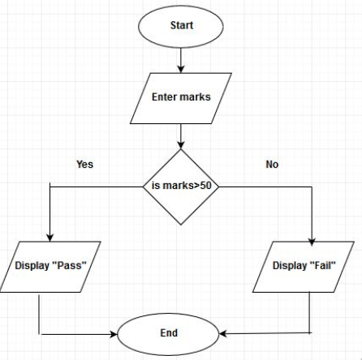

# Objectives

1. familiarize oneself with the computer systems.

2. perform the steps in the program development cycle.

3. appreciate the importance of pseudocode and flowchart.

---

# Review

Who invented the python programming language? 

--

Guido Van Rossum

--

Giving instructions to the computer to perform various tasks is
called?

--

Programming

--

What is a machine that can store and process information?

--

Computer
---

# Motivation - Two truths and a lie:

1. I am left-handed like my father.

2. My mother and I have the same middle name.

3. We grew up renting a house beside our school during elementary.

--

The false statement is #1. We are both right-handed.

---

# Introduction

Today we will be discussing about computer systems, program development life cycle,
planning tools.

---

# Understanding Computer Systems

Computer system: Combination of all the components
required to process and store data using a computer.

Hardware: Physical equipment associated with computers.

Software: Computer instructions that tell the hardware what
to do.

Programs: Instructions written by programmers

Programming: The process of writing software Instructions.

Application software: Comprises all the programs you apply
to a task, such as word-processing, spreadsheets, and games.

System software: Comprises the programs that you use to
manage your computer, such as Windows, Linux or Unix,
Google Android and Apple IOS.

---

# Major Operations of Computer

1. Input

2. Process

3. Output

# Computer Memory

Computer's temporary, internal storage - random access
memory (RAM).

Volatile memory - lost when the power is off.

permanent storage devices: nonvolatile memory

---

# Programming Language

A high-level programming language resembles the English
language.

Used to write computer instructions called program code.

Writing instructions is called coding the program.

Examples: C++, Java, or Python.


# Compiler or Interpreter

Translates source code into machine language(binary).

Checks for syntax errors.

---

# Program executes or runs
Input will be accepted, some processing will occur, and results.
will be output.

Programs with syntax errors cannot execute.

# Logical Errors
Errors in program logic produce incorrect output.

# Logic of Computer Program or Algorithm
Sequence of specific instructions in specific order.

# Variable
Named memory location whose value can vary.

---

# Understanding Program Development Cycle

1. Understanding the problem

2. Planning the logic

3. Code the Program

4. Use software to translate program to machine language

5. Test the program

6. Put program into Production

7. Maintain the program

---

# Planning Tools for Logic Development

.pull-left[
**Pseudocode**
```
start
  enter marks
  is marks greater than 50
    print pass
  else
    print fail
stop
```
]

.pull-right[
**Flowchart**

]

---

# Application - Two truths and a Lie

.pull-left[
1. Hardware is the equipment, or the devices, associated with a
computer. Software is computer instructions,

2. The grammar rules of a computer programming language are
its syntax.

3. You write programs using machine language, and translation
Software converts the statements to a programming language.
]

--

.pull-right[
The false statement is #3. You write programs using programming languages
such as Python or Java, and a translation program (called interpreter or
compiler) converts the statements into machine language, which is binary.
language.
]

---

# Generalization

1. What is a Computer System?

2. What are the three Major Operations of Computers?

3. Enumerate the steps in Program Development Cycle.

4. Give the two planning tools in logic development.