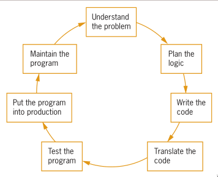
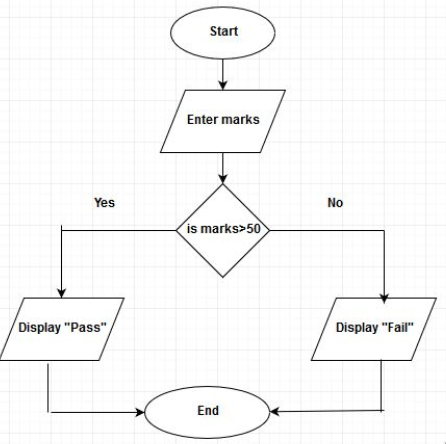

```{r xaringan-editable, echo=FALSE}
xaringanExtra::use_editable(expires = 1)
```

# Understanding Computer systems

**Hardware**

is the physical device, it may be input or output device

**Software**

computer instructions that tell computers what to do

**Application Software**

**System software**

---

# Important terms
**Input**

data items enter the computer system and placed in memory

**Process**

may invlove organizing or sorting inputs

**Output**

the result of processed data

**Central Processing Unit**

the hardware component that performs processing

---

# Basics of programming
you write computer instructions in a computer using **programming language**

every programming language has own rules, keywords and punctuation. these are called **syntax**

computer instructions or program are stored in the **RAM** for quick access

RAM is **volatile**, hard disks are **nonvolatile**

a program typed using programming language must be translated to machine langage(binary). millions of on and off circuits

your programming language statements are called **source code**

Each programmaing language may be an **compiled-language** or **interpreted language**

---

# Two truths and a lie

1. Hardware is the equipment, or the devices, associated with a computer. Software is computer instructions.

1. The grammar rules of a computer programming language are its syntax.

1. You write programs using machine language, and translation software converts the statements to a programming language.

---

# Answer 

The false statement is #3. You write programs using a programming language such
as Visual Basic or Java, and a translation program (called a compiler o interpreter)
converts the statements to machine language, which is Os and 1s.

---

# Understanding Simple Program Logic

A program with no syntax error can be executed. but still contain logical errors

you must develop a program with correct logic

## How to make a cake with logical error
```
Get a bowl
stir
Add two eggs
Add a gallon of gasoline
Bake at 350 degrees for 45 minutes
Add three cups of flour
```

---

# Simple computer program written in english
```
input myNumber
set myAnswer = myNumber * 2
output myAnswer
```
input myNumber is example of input operation

set myAnswer = myNumber * 2 is a process operation

output myAnswer is a output operation

myNumber is a **variable**

variable is named in the memory location. in python: id(var)

---

# Two truths and a lie
1. A program with syntax errors can execute but might produce incorrect results.

1. Although the syntax of programming languages differs, the same program logic can be expressed in different languages.

1. Most simple computer programs include steps that perform input, processing, and output.

---

# Answer

The false statement s #1. A program with syntax errors cannot execute; a program with no syntax errors can execute, but might produce incorrect results.

---

# Understanding the Program Development Cycle
.pull-left[
1. Understand the problem.
1. Plan the logic.
1. Code the program.
1. Use software (a compiler or interpreter) to translate the program into machine language.
1. Test the program.
1. Put the program into production.
1. Maintain the program.
]
.pull-right[

]

---
# Parts of Programming logic
1. input

1. process

1. output

1. variables

1. decisions

1. loops

```
while my_number is greater than 100
    print enter a number less than 100
    input my_number
```
---

# Writing Pseudocode
1. use imperative form of verbs(set, input, read, output, print, compute, start, stop)

1. a single line must be an input, process or output.

1. use descriptive variable names(do not use x, y, z)

1. focus on the readability

1. Use appropriate sentence casings, such as CamelCase for methods, upper case for constants and lower case for variables.

1. use indentations to show structure

```
if crush ka ng crush mo then
    print sana all
else
    print ouch
```
---
# Pseudo code for getting the sum of two input
```
input number1
input number2
compute answer = number1 + number2
print answer
```
---
# Pseudo code for converting dollar to peso
```
set one_dollar = 50
print enter the dollar amount you want to convert to peso
input dollar_amount
compute peso = dollar_amount * one dollar
print peso
```
---
# Activity

Write a pseudo code that ask for the temperature in celsius then output the farenheit value

.can-edit[Write your answer here]

---
# Answer

```
print enter the celsius value
input my_celsius
set farenheit_value = (celsius * 1.8) + 32
print my_celsius when converted to farenheit is farenheit_value
```
---
# Flowchart and Pseudocode
**Flowchart** represents an algorithm using diagram

**Pseudocode** is an informal way of writing a program
---
# Flowchart and Pseudocode

.pull-left[
**Flowchart**

]
.pull-right[
**Pseudocode**
```
input marks
is mark greater than 50
  print pass
else
  print fail
```
]
---
# Two truths and a lie
1. Understanding the problem that must be solved can be one of the most difficult
aspects of programming.

1. The two most commonly used logic-planning tools are flowcharts and
pseudocode.

1. Flowcharting a program is a very different process if you use an older
programming language instead of a newer one.
---
#Answer
The false statement is #3. Despite their differences, programming languages are
quite alike in their basic capabilities—each can handle input operations, arithmetic
processing, output operations, and other standard functions. The logic developed
to solve a programming problem can be executed using any number of languages.


