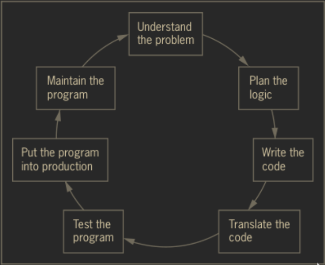

```{r xaringa-webcam, include = FALSE}
xaringanExtra::use_webcam()
```
```{r xaringan-themer, include=FALSE, warning=FALSE}
library(xaringanthemer)
style_mono_accent(
  base_color = "#23395b",
  header_font_google = google_font("Cabin"),
  text_font_google   = google_font("Noto Sans", "300", "300i"),
  code_font_google   = google_font("Fira Mono")
)
```
```{r xaringan-panelset, echo=FALSE}
xaringanExtra::use_panelset()
```
```{r xaringan-scribble, echo=FALSE}
xaringanExtra::use_scribble()
```

# Objectives

1. Determine and discuss computer systems and its functions.
2. Perform the steps involved in program development cycle.
3. Appreciate and value the significance of pseudocode and flowchart.

---
# Icebreaker

Title : Two truths and a Lie.

Instruction: In each Two Truths and a Lie section, two of the numbered statements are true, and one is false. Identify the false statement and explain why it is false.

1. RAM is volatile memory.
2. An example of word processing application is Google Sheets.
3. The language of computer is Binary.
---

# Answer
The statement number two is the lie. Google sheets is a spreadsheet application.
---

# Understanding Computer Systems

--

### Computer System
Combination of all the components required to process and store data using a computer.

--

### Hardware
Physical equipment associated with computers.

--

### Software
Computer instructions that tell the hardware what to do.

---
# Understand Computer Systems

### Application software
Comprises all the programs you apply to a task, such as word-processing, spreadsheets, and games.

--

### System software
Comprises the programs that you use to manage your computer, such as Windows, Linux or Unix, Google Android and Apple IOS.

---

# Major Operations of Computer

.panelset[

.panel[
.panel-name[Input]
Data items such as text, numbers, images, and sound.
]

.panel[
.panel-name[Process]
Calculations and comparisons performed by the central processing unit (CPU).
]

.panel[
.panel-name[Output]
.pull-left[
Resulting information that is sent to a printer, a monitor, or storage device after processing.
]

.pull-right[]
]

]

---
# Understanding the Program Development Cycle

Every programmers follow program development cycle instead of directly coding the program which is divided into seven steps: Understand the problem, Plan the logic, Code, Compile, Test, Put into production, and Maintain.

---
# Understanding the Program Development Cycle
.pull-left[
1. Understand the problem.
2. Plan the logic.
3. Code the program.
4. Use software (a compiler or interpreter) to translate the program into machine language.
5. Test the program.
6. Put the program into production.
7. Maintain the program.
]

.pull-right[]

---

# Planning Tools for Logic Development

.pull-left[
### Flowchart
Represents an algorithm using diagram

### Pseudocode
An informal way of writing a program
]

--

.pull-right[

]

---

# Example

.panelset[

.panel[.panel-name[flowchart]


]

.panel[.panel-name[pseudocode]
```python
input marks
if marks greater than 50
  print "pass"
else
  print "fail"```
]


]
---
## What is a Computer System?

--

## What are the three Major Operations of Computers?

--

##  Enumerate the steps in Program Development Cycle

--

## Give the two planning tools in developing logic

---
### A. Follow-up Assignment: 

### Research flowchart symbols and its uses.
1. Input/Output
2. Process
3. Decision
4. Terminal
5. Declaration

---
### B. Advance Assignment:
### Create a flowchart based on the pseudocode given below:

```
print enter the celsius value
input my_celsius
set farenheit_value = (my_celsius * 1.8) + 32
print my_celsius when converted to farenheit is farenheit_value
```

---
# References
Farrell, J. (2014). Programming logic and design,
comprehensive. Cengage Learning.